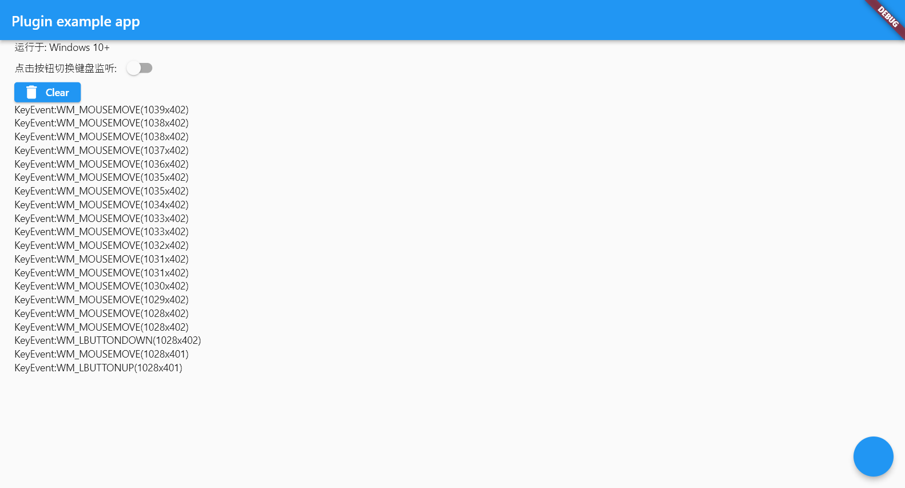

# Mouse Event



Flutter Plugin for Windows to catch mouse events, even if you are using other programs;


This Plugin use Windows 's [`SetWindowsHookEx`](https://docs.microsoft.com/zh-cn/windows/win32/api/winuser/nf-winuser-setwindowshookexa?redirectedfrom=MSDN) API. click the links for details.
> WH_MOUSE_LL :  
> Installs a hook procedure that monitors low-level mouse input events. For more information, see the [LowLevelMouseProc](https://docs.microsoft.com/en-us/previous-versions/windows/desktop/legacy/ms644986(v=vs.85)) hook procedure.


## Getting Started

See [example demo](./example)

```dart
// start listening
MouseEventPlugin.startListening((mouseEvent) {
});
// stop listening
MouseEventPlugin.cancelListening();
```

## Link
If you want to catch keyboard event, check this repository out  
[Keyboard Event](https://github.com/Krysl/keyboard_event)
